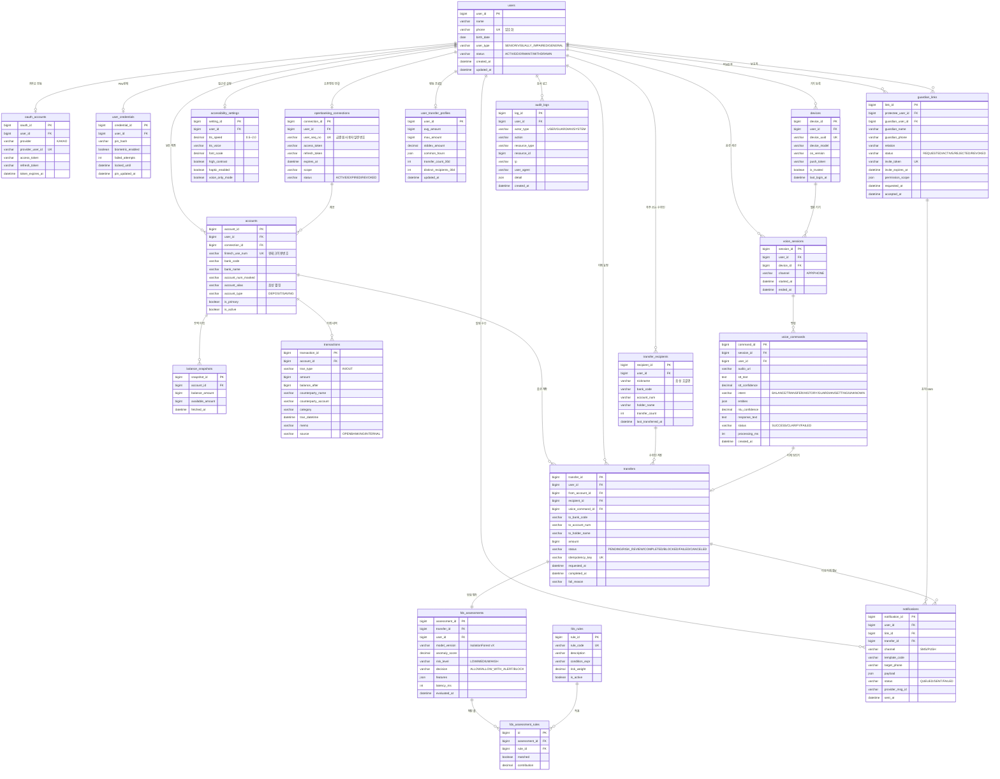

# 보이스뱅크 ERD

Voice-First Inclusive Banking · MVP 데이터 모델
기준 문서: `MVP 기능명세서`, User Flow & Mockup

---

## 1. 도메인 구성

| # | 도메인 | 핵심 테이블 | 대응 플로우 |
|---|--------|------------|-------------|
| 1 | 사용자·인증 | `users`, `oauth_accounts`, `user_credentials`, `devices`, `accessibility_settings` | ① 인증 플로우, 설정 |
| 2 | 오픈뱅킹·계좌 | `openbanking_connections`, `accounts`, `balance_snapshots` | 오픈뱅킹 연결, 잔액 조회 |
| 3 | 거래·이체 | `transactions`, `transfers`, `transfer_recipients` | 송금/이체, 거래 내역 |
| 4 | 음성 | `voice_sessions`, `voice_commands` | ② 메인 허브(음성 명령 대기) |
| 5 | 보호자 | `guardian_links`, `notifications` | 보호자 연결, SMS 발송, 대시보드 |
| 6 | FDS | `fds_assessments`, `fds_rules`, `fds_assessment_rules`, `user_transfer_profiles` | ⑤ FDS 위험도 처리 |
| 7 | 공통 | `audit_logs` | 전 구간 |

---

## 2. ERD



---

## 3. 핵심 플로우 ↔ 테이블 매핑

### ① 인증 플로우
```
앱 시작 → 카카오 로그인      → oauth_accounts (provider_user_id 조회/생성) + users
        → PIN/생체인증       → user_credentials (pin_hash 검증, failed_attempts++)
        → (신규) 오픈뱅킹 연결 → openbanking_connections + accounts 벌크 등록
```

### ③④ 음성 명령 → 이체
```
홈(음성 대기)  → voice_sessions 생성
발화           → voice_commands (stt_text, intent=TRANSFER, entities={수취인,금액})
이체 정보 확인 → transfers INSERT (status=PENDING, idempotency_key)
```

### ⑤ FDS 위험도 분기
```
transfers.status = RISK_REVIEW
  → fds_assessments (Isolation Forest anomaly_score 산출)
     · 피처 소스: user_transfer_profiles + transactions + devices + voice_commands
     · fds_assessment_rules 로 룰 기여도 기록

  LOW    → decision=ALLOW             → transfers.status=COMPLETED
  MEDIUM → decision=ALLOW_WITH_ALERT  → transfers.status=COMPLETED (이체는 그대로 진행)
                                       + notifications(SMS, RISK_TRANSFER_ALERT) 보호자 통보
  HIGH   → decision=BLOCK             → transfers.status=BLOCKED
                                       + notifications(SMS, BLOCKED_TRANSFER_ALERT) 보호자 통보
```

> **MVP 범위 조정** — 보호자 *승인*(사전 차단) 기능은 제외했습니다. 보호자는 승인 권한 없이 SMS 알림만 받습니다.
> 중위험 이체는 대기 없이 즉시 처리되고, 보호자에게 사후 통보만 나갑니다. 승인 대기 상태가 없으므로
> `guardian_approvals` 테이블과 `transfers.status`의 `GUARDIAN_PENDING`은 삭제했습니다.

### 보호자 연결
```
연결 요청 → guardian_links (status=REQUESTED, invite_token 발급)
SMS 발송  → notifications (channel=SMS, template_code=GUARDIAN_INVITE)
수락      → guardian_links.status=ACTIVE, guardian_user_id 바인딩
대시보드  → guardian_links.permission_scope 로 조회 범위 제어
           (MVP: {"view_balance":true, "receive_alert":true} — 승인 권한 없음)
```

---

## 4. 설계 결정 사항

**1. `transfers`와 `fds_assessments` 1:1 분리**
FDS는 모델 버전·피처·지연시간이 계속 바뀌는 영역이라 이체 본체 테이블에 컬럼을 붙이면 스키마가 계속 흔들립니다. 재평가(모델 교체 후 백테스트)도 별도 테이블이 편합니다.

**2. `guardian_links`의 self-referencing FK**
보호자도 앱 사용자입니다. 다만 SMS 초대 직후에는 아직 가입 전이므로 `guardian_user_id`는 nullable이고, `guardian_phone`으로 먼저 식별합니다. 수락 시점에 바인딩.

**3. `transfer_recipients` 별도 분리**
"엄마한테 5만원 보내줘" 같은 음성 명령을 해석하려면 별칭↔계좌 매핑이 필수입니다. 동시에 `transfer_count`는 FDS의 "처음 보내는 상대" 피처로 직접 쓰입니다.

**4. `idempotency_key` on `transfers`**
음성 인식은 오인식·중복 발화가 잦습니다. 클라이언트가 발급한 키로 중복 이체를 차단해야 합니다.

**5. `balance_snapshots` 유지**
오픈뱅킹 잔액 조회는 API 호출 비용/속도 제약이 있어 캐시가 필요하고, FDS 피처(잔액 대비 이체 비율)에도 씁니다.

**6. `notifications.transfer_id` 추가**
보호자 승인이 빠지면서 알림이 이상거래 통보의 유일한 수단이 됐습니다. "어떤 이체 때문에 나간 알림인지" 추적할 수 없으면 사후 대응이 불가능하므로 이체를 직접 참조합니다.

**7. 개인정보 컬럼 암호화**
`users.phone`, `accounts.account_num_masked`, `transfers.to_account_num`, `guardian_links.guardian_phone`은 AES 양방향 암호화 대상. 토큰류(`access_token`, `refresh_token`)도 동일.

---

## 5. 주요 인덱스

| 테이블 | 인덱스 | 용도 |
|--------|--------|------|
| `oauth_accounts` | `uk (provider, provider_user_id)` | 카카오 로그인 조회 |
| `accounts` | `idx (user_id, is_active)` | 홈 진입 시 계좌 목록 |
| `transactions` | `idx (account_id, tran_datetime DESC)` | 거래 내역 기간 필터 |
| `transfers` | `uk (idempotency_key)` / `idx (user_id, requested_at DESC)` | 중복 방지 / 이체 이력 |
| `voice_commands` | `idx (user_id, created_at DESC)` / `idx (intent, status)` | 음성 로그 분석 |
| `guardian_links` | `idx (protectee_user_id, status)` / `uk (invite_token)` | 활성 보호자 조회 / 초대 수락 |
| `notifications` | `idx (status)` / `idx (user_id, created_at DESC)` | 발송 재시도 / 알림 이력 |
| `fds_assessments` | `idx (user_id, evaluated_at DESC)` | 프로필 갱신 |

---

## 6. 다음 단계

1. `docs/schema.sql` DDL 검토 및 로컬 MySQL 반영
2. `build.gradle`에 `spring-boot-starter-data-jpa`, `mysql-connector-j`, `spring-boot-starter-security`, `spring-boot-starter-validation` 추가
3. 도메인별 Entity 클래스 생성 (`com.movi_backend.domain.*`)
4. 인증 플로우(카카오 → PIN → 오픈뱅킹) API부터 구현
